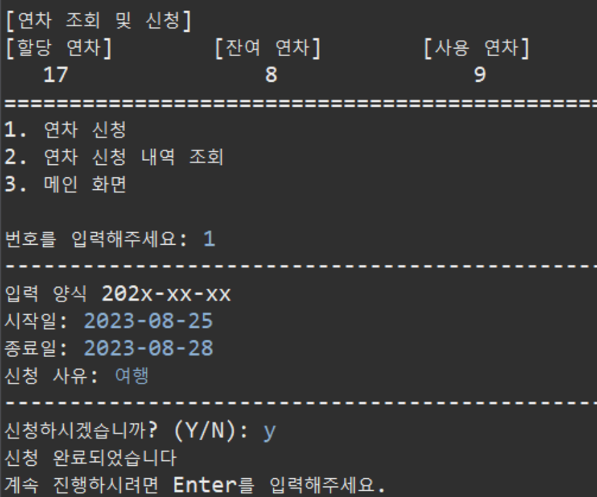
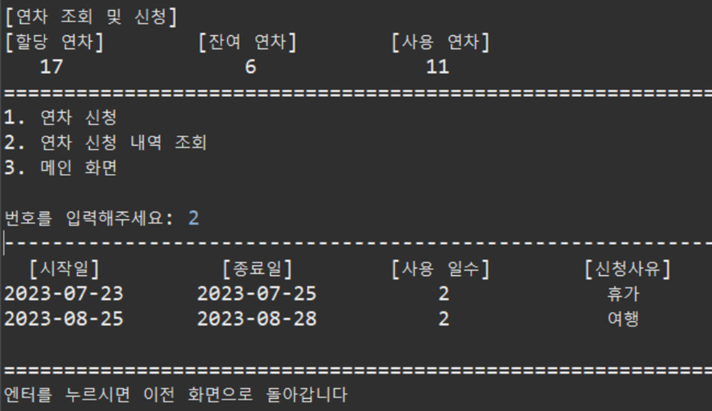
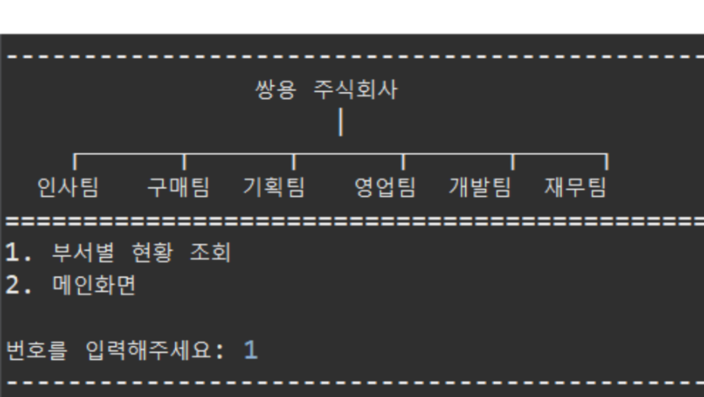
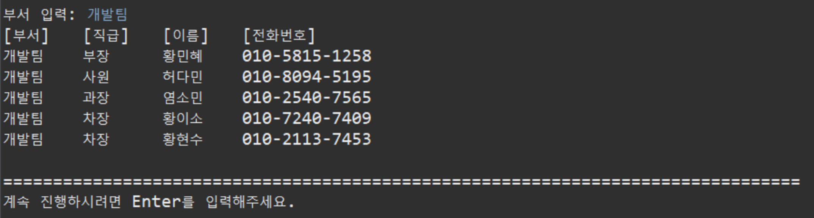
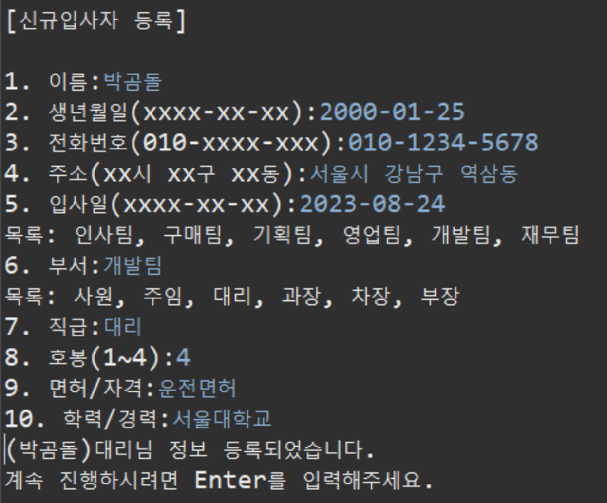
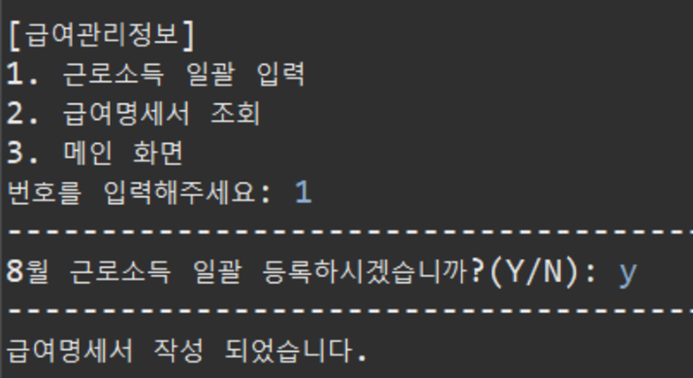
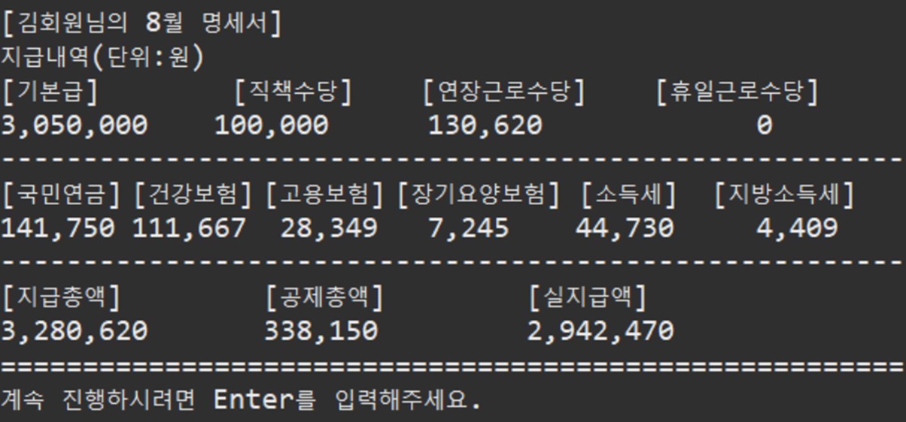
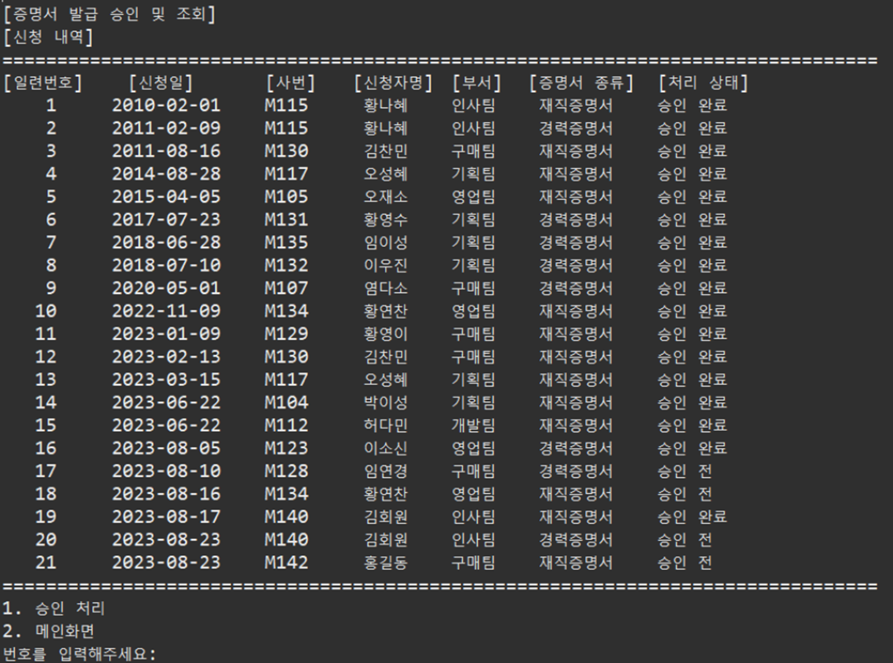

# :office: 인사관리 ERP 시스템
....
# 1. 기획 의도
근태, 연차, 급여, 각종 증명서 발급 
간편한 인사관리로 사용자/관리자 모두에게 불필요한 사무 절차를 줄여주는 프로그램

# 2. 🛠개발 환경
 

# 3. 👯‍♂️역할 분담
- 공통: 기획서작성, 요구 분석서 작성, 기능명세서 작성
- 김수진 : 사용자 조직도, 부서별 현황 조회 기능, 사용자/관리자 연차 관련 기능 구현 
- 박나래 : 마이페이지, 사용자/관리자 증명서 관련 기능 구현 
- 염현빈 : Open API 기능 구현, 데이터 관계도 작성, 로그인 퇴직금 관련 기능 구현 
- 임성은 : 관리자 인사 관련 기능 구현 
- 차수민 : Open API 기능 구현, 사용자/관리자 근태 관련 전반적인 기능 구현 
- 허수경 : 순서도 작성, 데이터 관계도 작성, 사용자/관리자 급여 관련 전반적인 기능 구현 

# 4. 데이터 구조
## 1. 순서도
> 

## 2. 전체 데이터
> 

# 5. 기능 구현
## 1. 초기 화면
> - login page  
> 

> - 메인 
> 
> 

> - 오픈 API 사용  
> 
> 
> 

## 2. 기능 화면
> - 연차 조회 및 신청 
> 
> 
> - 조직도, 부서별 현황 조회  
> 
> 
> - 신규 입사자 등록  
> 
> - 급여 관리 정보 
> 
> 
> - 증명서 발급 승인 및 조회 
> 

# 6. 📜세부 일정
> <strong>8월 10일 ~ 8월 14일</strong> 
>> - 주제 선정
>> - 기획서
>> - 요구사항 분석 

> <strong>8월 14일 ~ 8월 17일</strong> 
>> - 순서도
>> - 화면설계
>> - 기능명세서  

> <strong>8월 17일 ~ 8월 18일</strong> 
>> - 더미 데이터
>> - 기초 코드 구성 

> <strong>8월 18일 ~ 8월 21일</strong> 
>> - 코드 작성 

> <strong>8월 21일 ~ 8월 22일</strong> 
>> - 기능 확인 및 디버깅
>> - 프레젠테이션 작성  

> <strong>8월 23일</strong> 
>> - 발표  
  
  # 핵심 트러블 슈팅

 <strong>1. 배우지 않았던 MVC패턴을 적용시키려고 함.</strong> 

  - 콘솔 프로젝트 특성상 controller를 제외 함, 초반에 설명과 이해가 힘들었지만 완성 후 코드 수정과 관리가 편한 이점이 있음.  

# 그 외 이슈

<strong>
  </strong> 

  

  
  

  
