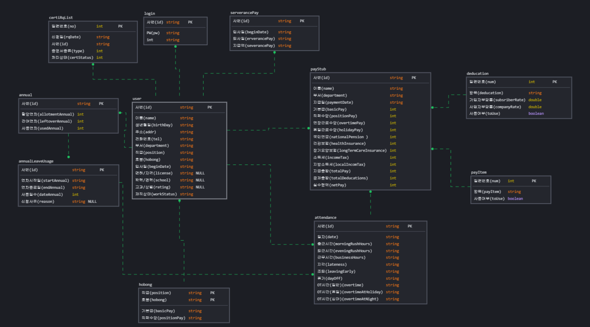
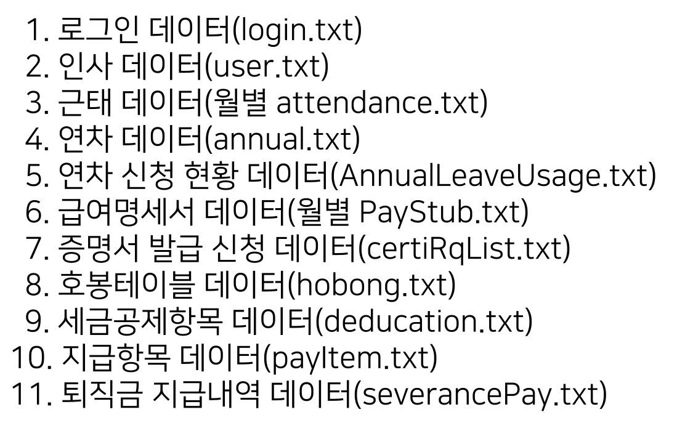
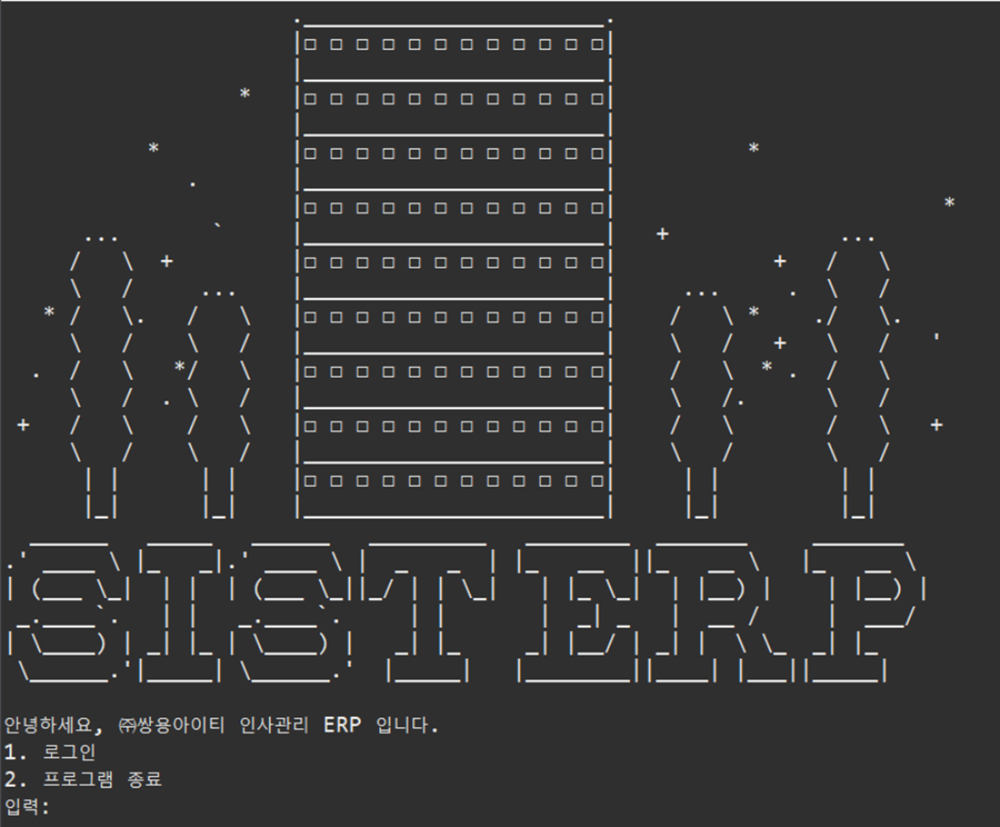
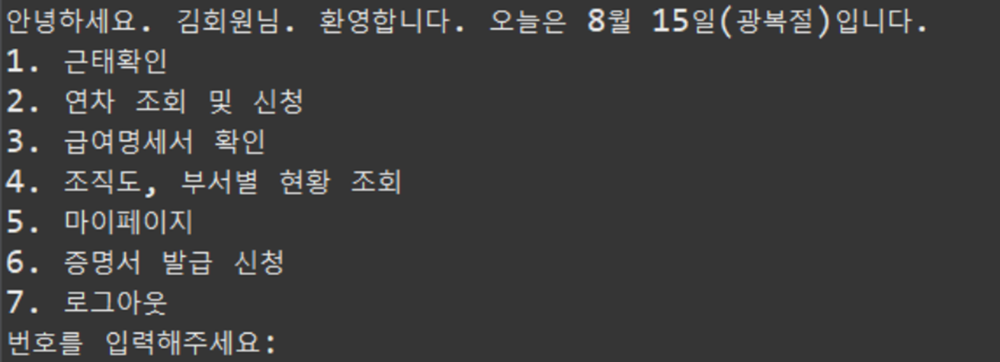
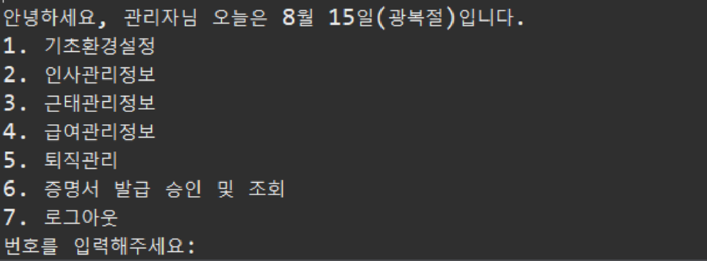
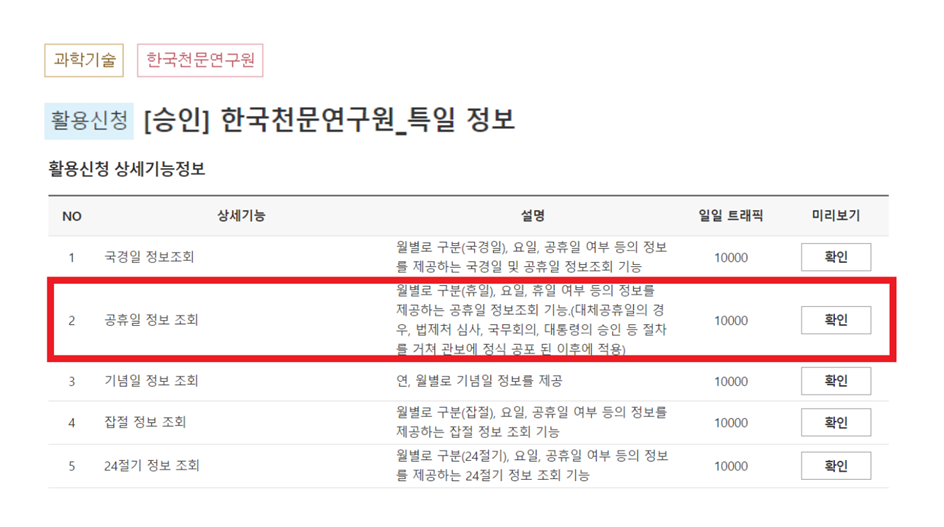
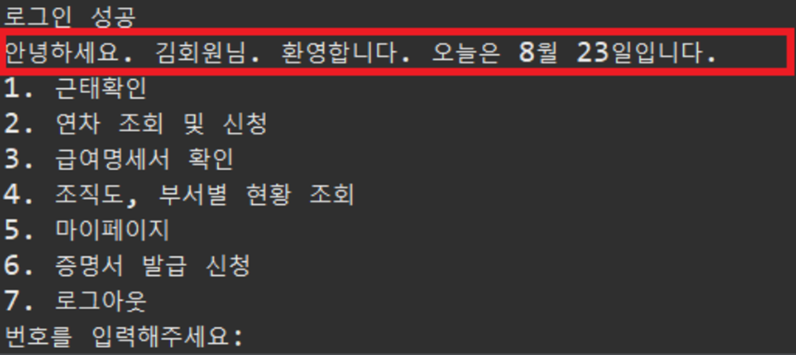
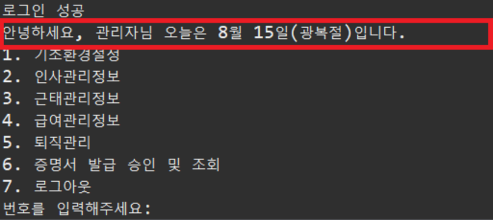

# :office: 인사관리 ERP 시스템
....
# 1. 기획 의도
근태, 연차, 급여, 각종 증명서 발급 
간편한 인사관리로 사용자/관리자 모두에게 불필요한 사무 절차를 줄여주는 프로그램

# 2. 🛠개발 환경
 

# 3. 👯‍♂️역할 분담
- 공통: 기획서작성, 요구 분석서 작성, 기능명세서 작성
- 김수진 : 사용자 조직도, 부서별 현황 조회 기능, 사용자/관리자 연차 관련 기능 구현 
- 박나래 : 마이페이지, 사용자/관리자 증명서 관련 기능 구현 
- 염현빈 : Open API 기능 구현, 데이터 관계도 작성, 로그인 퇴직금 관련 기능 구현 
- 임성은 : 관리자 인사 관련 기능 구현 
- 차수민 : Open API 기능 구현, 사용자/관리자 근태 관련 전반적인 기능 구현 
- 허수경 : 순서도 작성, 데이터 관계도 작성, 사용자/관리자 급여 관련 전반적인 기능 구현 

# 4. 데이터 구조
## 1. 순서도
> 

## 2. 전체 데이터
> 

# 5. 기능 구현
## 1. 초기 화면
> - login page  
> 

> - 메인 
> 
> 

> - 오픈 API 사용  
> 
> 
> 

> - 게시글 검색, 카테고리로 게시글 정렬  
> 
> - 게시글 작성  
> 
> - 세부 게시글 페이지 및 좋아요 기능  
> 
> - 유저의 작성글 목록 및 카테고리별 게시글 
> 
> - 유저 개인정보 업데이트 
> 

## 2. DB 구조 
> - data base   
> 

> 

# 5. 📜세부 일정

> <strong>5월 16일 ~ 5월 29일 (2주간)</strong> 
>> - 페이지 목업 디자인 완료
>> - 요구사항 분석
>> - DB설계 마무리
>> - 기본 CRUD 기능 구현 

> <strong>5월 16일 ~ 5월 22일 (1주간)</strong> 
>> - 검색, 정렬 기능 구현 
>> - UI 구현  

> <strong>5월 22일 ~ 5월 29일 (1주간)</strong> 
>> - 로그인 기능 구현 

> <strong>5월 30일 : 중간 점검 (대면) 

> <strong>5월 31일 ~ 6월 15일</strong> 
>> - 추가 기능(채팅, 지도, 추후 협의) 구현  
>> - 배포 및 디버깅  

> <strong>6월 16일 : 최종 점검 (대면)</strong> 

  
  # 핵심 트러블 슈팅

 <strong>1.home/list에서 조건조회를 하게되면 첫post이외 나머지 post의 img파일이 조회가 되지않음.</strong> 

  - 문장열 결합으로 해당 jpg file의 url을 만들어주기 때문에 문자열 결합 내용을 확인해 보게 되면 경로에 들어가는 / 가 \로 결합되어있습니다 . 
  해당내용은 JS로 replaceAll 함수사용하여 해결해 보았으나 최초 한번 호출되기 때문에 첫게시글 이후 게시글에는 문자열 결합시 \로 결합되어 있는 것을 확인하여 
  each 문으로 각 게시글에 해당내용 적용시켜주어 디버깅 하였습니다 .  

# 그 외 이슈

 <strong>
  </strong> 

  

  
  

  
